# Pravas

<blockquote style="padding:20px">
  <h1>  🧑‍💻  About</h1>
  

  Pravas is the tourism website where user can user can search and the book the package and there are admin who can add the package details in very descriptive manner. It is built with python Django framework for managing the server side request and data manipulation with database and for database we used the Django's default sqlite3. It have so much descriptive models and have functionalities like package search with destination, price and month, see the package in so much depth, Update the profile and see the booked and past packages.
  

</blockquote>

<h1> 💻 How to run project. </h1>

<blockquote style="padding:20px">
    <h3>
        <ol>
            <li>Clone repository or download zip file </li>
            <li>Open terminal and use command <code> python manage.py makemigrations </code> & <code> python manage.py migrate </code>
            </li>
            <li> Use <code> python manage.py runserver </code> for start server</li>
            <li> Login default admin and user with username: <b>pravas</b> password: <i>pravas</i></li>
        </ol>
    </h3>
</blockquote>

  <h1> 🧐 Let's see the project </h1>
  <h2 style="padding:5px 20px"> 🥸 Login and Signup </h2>
  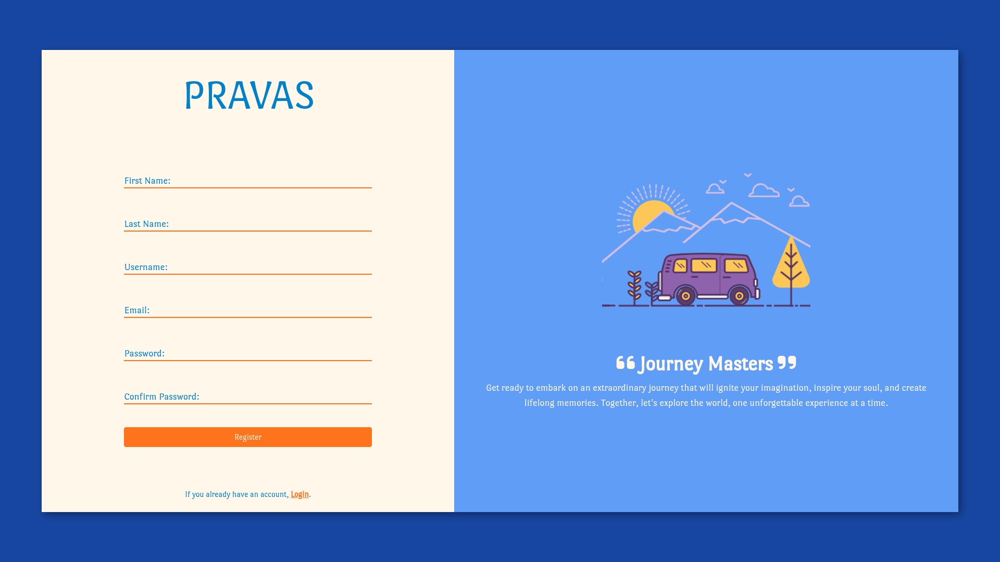
  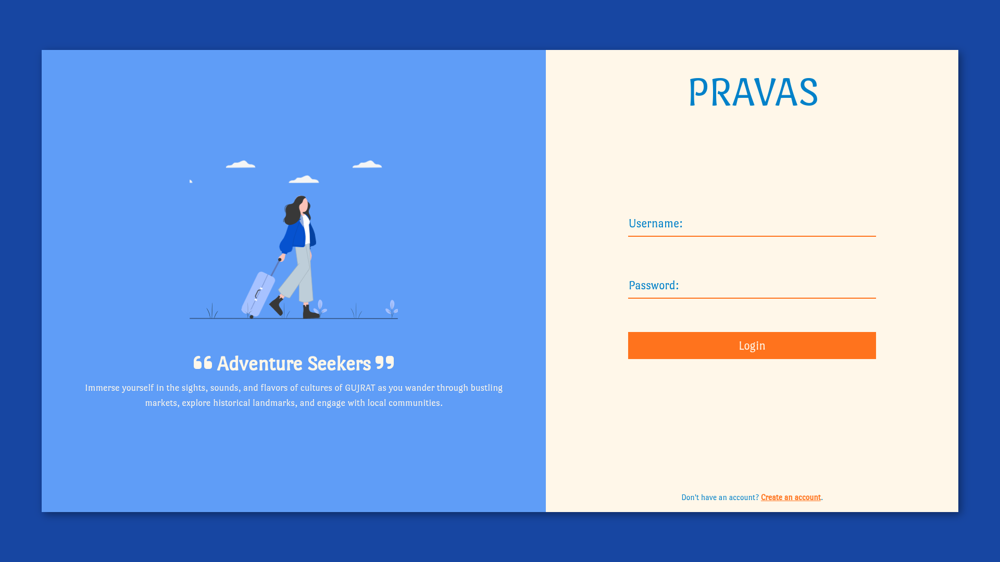
  <h2 style="padding:5px 20px"> 🛩  Landing page </h2>
  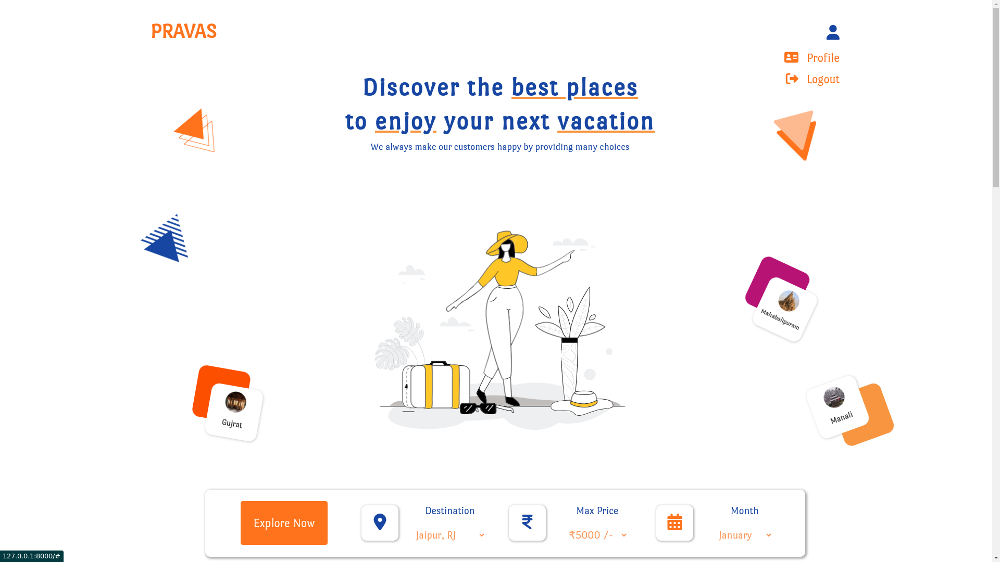
  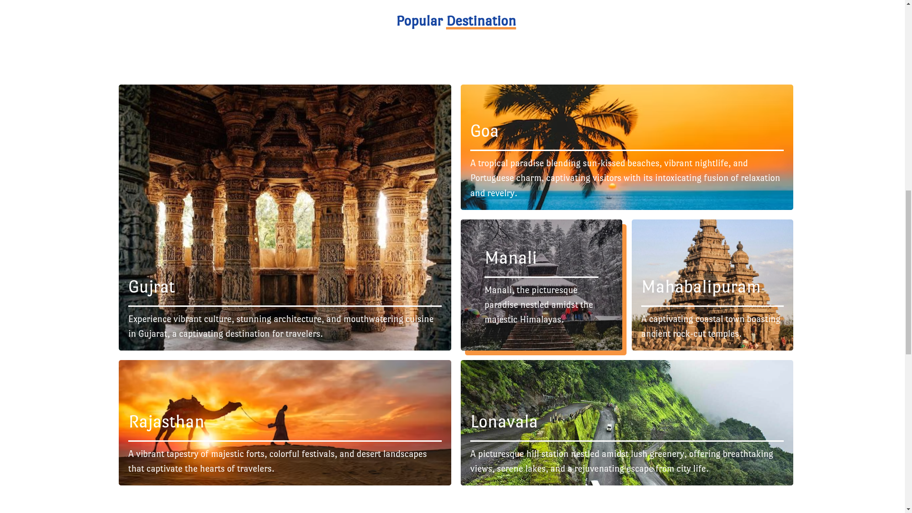
  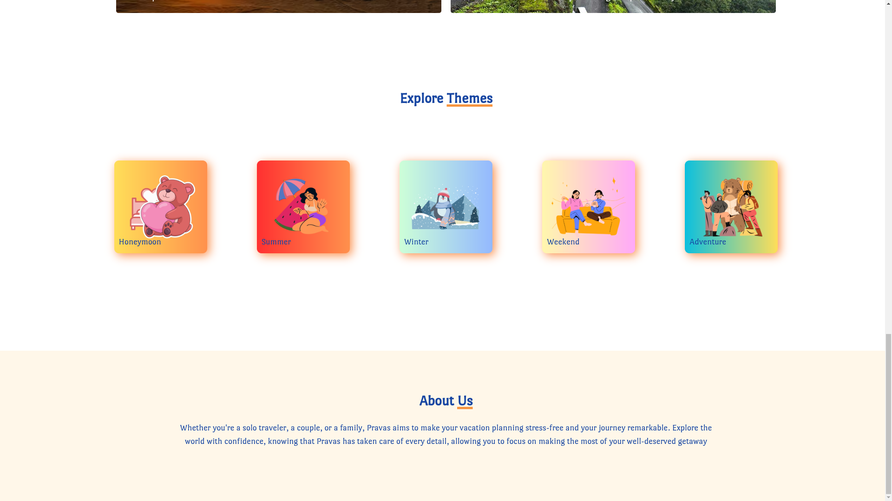
  <h2 style="padding:5px 20px"> 🧑🏽  Profile Page </h2>
  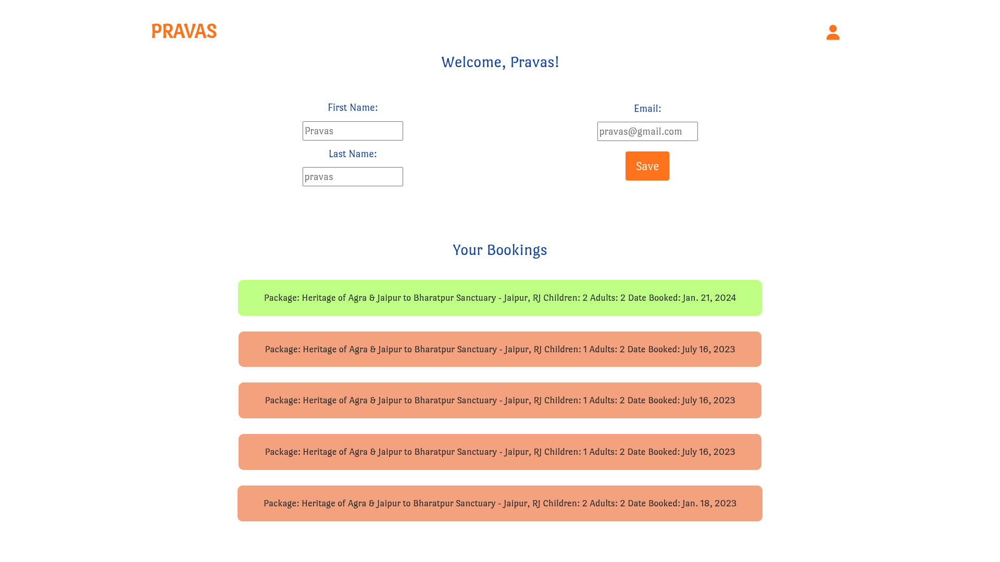
  <h2 style="padding:5px 20px">  🔍 Package Search </h2>
  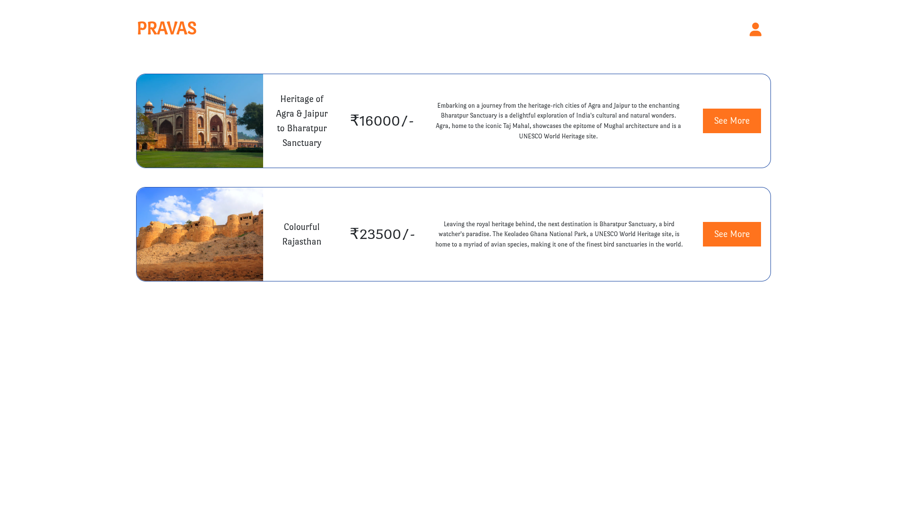
  <h2 style="padding:5px 20px">  📋 Package details </h2>
  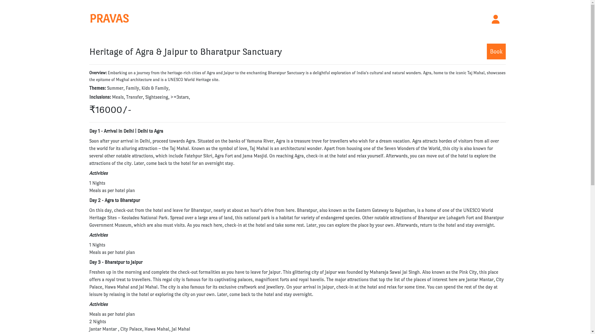
  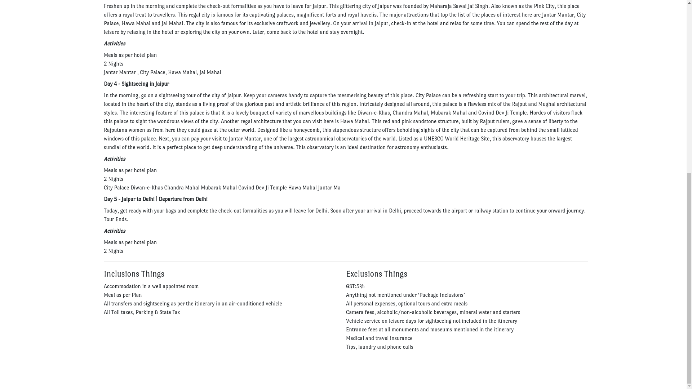
  <h2 style="padding:5px 20px"> ☑️ Book Package </h2>
  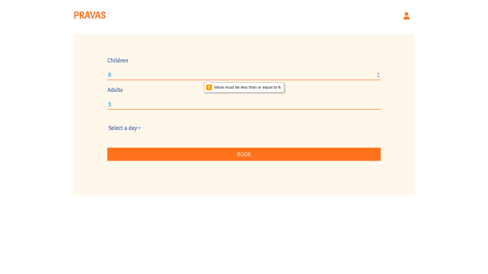
  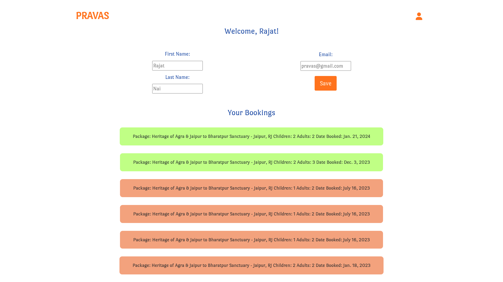
  <h2 style="padding:5px 20px"> 📑  Database </h2>
  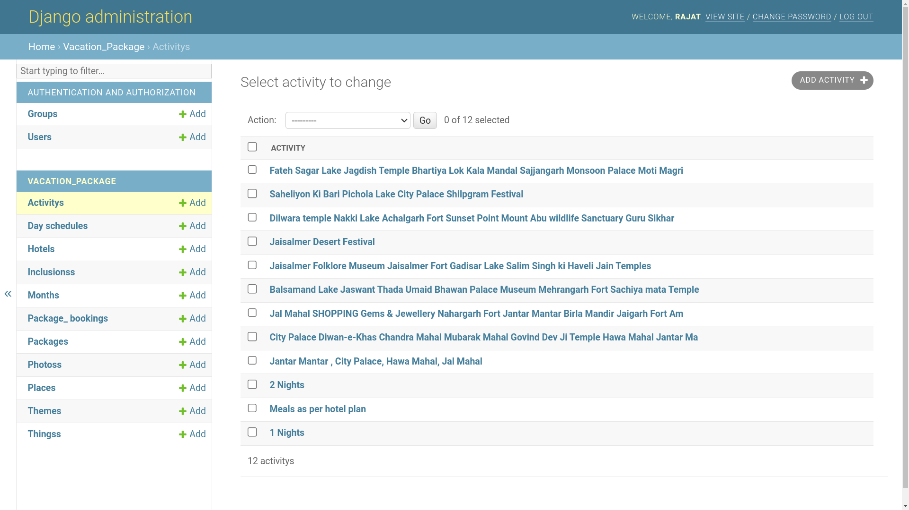

